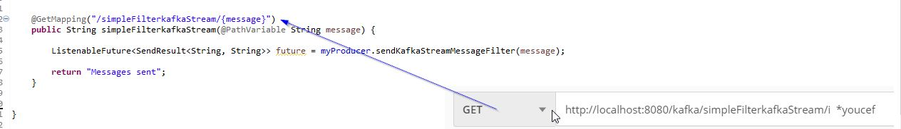

# spring kafka


## Classes de configuration

ici nous creer 3 classes de configuration pour le **consumer** et le **producer** et **newTopic** 

Dans ce projet nous utilsons les callbacks pour recuperer le message du retour de kafka , et aussi comment envoyer un oject **greeting** dans un topic dédié.

Nous utilisons aussi kafka stream. Nous ajoutons une classe de configuration  et définissons les annotations @Configuration et @EnableKafka. En plus de cela, nous annotons également cette classe avec **@EnableKafkaStreams**. La seule chose que nous devons faire est d'ajouter un bean KafkaStreamsConfiguration  nommé **defaultKafkaStreamsConfig**. Dans notre cas, c'est la méthode **kStreamsConfigs**  qui contient les propriétés Kafka nécessaires. Cela créera un Bean **StreamsBuilderFactory** que nous pourrons éventuellement utiliser dans notre methode kStream. Dans la methode kStream, nous lison le flux du topic, de le filtrer et de publier le flux filtré sur un autre topic. Comme vous le remarquerez, nous n'avons pas besoin de démarrer le flux nous-mêmes, Spring s'en chargera.


**KafkaConsumerConfig**  

Configure les parametres du consumer en lieu et place du fichier application.properties puis renvoi un objet **ConcurrentKafkaListenerContainerFactory**.

```java

@Configuration
public class KafkaConsumerConfig {

	@Value("${kafka.bootstrap-servers}")
	private String bootstrapServers;

	@Bean
	public Map<String, Object> consumerConfigs() {

		Map<String, Object> configProps = new HashMap<String, Object>();
		// list of host:port pairs used for establishing the initial connections to the Kafka cluster
		configProps.put(ConsumerConfig.BOOTSTRAP_SERVERS_CONFIG, bootstrapServers);
		configProps.put(ConsumerConfig.KEY_DESERIALIZER_CLASS_CONFIG, StringDeserializer.class);
		configProps.put(ConsumerConfig.VALUE_DESERIALIZER_CLASS_CONFIG, StringDeserializer.class);
		// allows a pool of processes to divide the work of consuming and processing  records
		configProps.put(ConsumerConfig.GROUP_ID_CONFIG, "group-id");

		return configProps;
	}
	
	

	@Bean
	public ConsumerFactory<String, String> consumerFactory() {
		return new DefaultKafkaConsumerFactory<String, String>(consumerConfigs());
	}

	@Bean
	public ConcurrentKafkaListenerContainerFactory<String, String> concurrentKafkaListenerContainerFactory() {
		ConcurrentKafkaListenerContainerFactory<String, String> factory = new ConcurrentKafkaListenerContainerFactory<String, String>();
		factory.setConsumerFactory(consumerFactory());
		//factory.setConcurrency(1);
	    //factory.getContainerProperties().setPollTimeout(3000);
        //factory.setRecordFilterStrategy(record -> record.value().contains("World"));
		return factory;
	}
	
	
	////////////////////////////////////////////////////////////////
	
	// Gestion des Objets
	
	
	 public ConsumerFactory<String, Greeting> greetingConsumerFactory() {
	        Map<String, Object> props = new HashMap<>();
	        props.put(ConsumerConfig.BOOTSTRAP_SERVERS_CONFIG, bootstrapServers);
	        props.put(ConsumerConfig.GROUP_ID_CONFIG, "greeting");
	        return new DefaultKafkaConsumerFactory<>(props, new StringDeserializer(), new JsonDeserializer<>(Greeting.class));
	    }

	    @Bean
	    public ConcurrentKafkaListenerContainerFactory<String, Greeting> greetingKafkaListenerContainerFactory() {
	        ConcurrentKafkaListenerContainerFactory<String, Greeting> factory = new ConcurrentKafkaListenerContainerFactory<>();
	        factory.setConsumerFactory(greetingConsumerFactory());
	        return factory;
	    }
}

```


**KafkaProducerConfig**  

Configure les parametres du producer en lieu et place du fichier application.properties puis renvoi un objet **KafkaTemplate**.

```java

@Configuration
public class KafkaProducerConfig {

	  @Value("${kafka.bootstrap-servers}")
	  private String bootstrapServers;
	  
	  @Bean
	  public Map<String, Object> producerConfigs() {

			Map<String, Object> configProps = new HashMap<String, Object>();
			configProps.put(ProducerConfig.BOOTSTRAP_SERVERS_CONFIG , bootstrapServers );
			configProps.put(ProducerConfig.KEY_SERIALIZER_CLASS_CONFIG , StringSerializer.class);
			configProps.put(ProducerConfig.VALUE_SERIALIZER_CLASS_CONFIG , StringSerializer.class);

	    return configProps;
	  }
	  
	  
	@Bean
	public ProducerFactory<String, String> producerFactory(){
		return new DefaultKafkaProducerFactory<String, String>(producerConfigs());
	}
	
	@Bean
	public KafkaTemplate<String, String> kafkaTemplate(){
		return new KafkaTemplate<String, String>(producerFactory());
	}
	
	
	/////////////////////////////////////////////////////////////////////////////////
	
	  @Bean
	    public ProducerFactory<String, Greeting> greetingProducerFactory() {
	        Map<String, Object> configProps = new HashMap<>();
	        configProps.put(ProducerConfig.BOOTSTRAP_SERVERS_CONFIG, bootstrapServers);
	        configProps.put(ProducerConfig.KEY_SERIALIZER_CLASS_CONFIG, StringSerializer.class);
	        configProps.put(ProducerConfig.VALUE_SERIALIZER_CLASS_CONFIG, JsonSerializer.class);
	        return new DefaultKafkaProducerFactory<>(configProps);
	    }

	    @Bean
	    public KafkaTemplate<String, Greeting> greetingKafkaTemplate() {
	        return new KafkaTemplate<>(greetingProducerFactory());
	    }
	
}

```


**KafkaStream**

```java
@Configuration
@EnableKafka
@EnableKafkaStreams
public class KafkaStreamsConfig {

	@Value("${kafka.bootstrap-servers}")
	private String bootstrapServers;

	@Value("${kafkaStream.topicInput}")
	private String INPUT_TOPIC;

	@Value("${kafkaStream.topicOutput}")
	private String OUTPUT_TOPIC;

	@Bean(name = KafkaStreamsDefaultConfiguration.DEFAULT_STREAMS_CONFIG_BEAN_NAME)
	public KafkaStreamsConfiguration kafkaStreamsConfig() {
		Map<String, Object> configProps = new HashMap<String, Object>();
		// list of host:port pairs used for establishing the initial connections to theKafka cluster
		configProps.put(StreamsConfig.BOOTSTRAP_SERVERS_CONFIG, bootstrapServers);
		configProps.put(StreamsConfig.APPLICATION_ID_CONFIG, "mykafkaStream");
		configProps.put(StreamsConfig.DEFAULT_KEY_SERDE_CLASS_CONFIG, Serdes.String().getClass().getName());
		configProps.put(StreamsConfig.DEFAULT_VALUE_SERDE_CLASS_CONFIG, Serdes.String().getClass().getName());
		// Stream processing is often stateful. When we want to save intermediate results, we need to specify the STATE_DIR_CONFIG parameter.
		//configProps.put(StreamsConfig.STATE_DIR_CONFIG, );
		  
		return new KafkaStreamsConfiguration(configProps);

	}
	
	
	@Bean
	public KStream<String, String> kStream(StreamsBuilder streamsBuilder){

		// Keep only sentence ended with *youcef
		//For every sentence sent to inputTopic, we want to split it into words and calculate the occurrence of every word.
		Pattern pattern = Pattern.compile("\\W+", Pattern.UNICODE_CHARACTER_CLASS);
		
		KStream<String, String> stream = streamsBuilder.stream(INPUT_TOPIC,Consumed.with(Serdes.String(), Serdes.String()));
		
		stream.print(Printed.toSysOut());
	    stream.filter((key, value) -> ((String) value).endsWith("*youcef")).to(OUTPUT_TOPIC ,Produced.with(Serdes.String(), Serdes.String()));
	    return stream ; 
	}
}
```


**newTopic**

```java
@Configuration
public class KafkaTopicConfig {


	@Value("${kafka.topic}")
	private String TOPIC_NAME;

	@Value("${kafka.bootstrap-servers}")
	private String bootstrapServers;

	  @Value(value = "${greeting.topic.name}")
	    private String greetingTopicName;
	  
	@Bean
	public NewTopic mySpringKafkaMessageTopic() {
	  return TopicBuilder.name(TOPIC_NAME)
	    .partitions(1)
	    .replicas(1)
	    .compact()
	    .build();
	}
	
	
	@Bean
	public NewTopic mySpringGreetingTopic() {
	  return TopicBuilder.name(greetingTopicName)
	    .partitions(1)
	    .replicas(1)
	    .compact()
	    .build();
	}
	
```


## Creation d'un restcontroller, consumer et un producer


**restcontroller**  

```java
package com.example.demo.controller;

import org.springframework.beans.factory.annotation.Autowired;
import org.springframework.kafka.support.SendResult;
import org.springframework.util.concurrent.ListenableFuture;
import org.springframework.util.concurrent.ListenableFutureCallback;
import org.springframework.web.bind.annotation.GetMapping;
import org.springframework.web.bind.annotation.PathVariable;
import org.springframework.web.bind.annotation.PostMapping;
import org.springframework.web.bind.annotation.RequestBody;
import org.springframework.web.bind.annotation.RequestMapping;
import org.springframework.web.bind.annotation.RequestParam;
import org.springframework.web.bind.annotation.RestController;

import com.example.demo.MyProducer;
import com.example.demo.entities.Greeting;

@RestController
@RequestMapping(value = "/kafka")
public class KafkaController {

	@Autowired
	private MyProducer myProducer;

	@GetMapping("/simple/{message}")
	public String sendMessage(@PathVariable String message) {

		ListenableFuture<SendResult<String, String>> future = myProducer.sendMessageString(message);

		return "Messages sent";
	}

	@GetMapping(value = "/publish")
	public String sendMessageToKafkaTopic(@RequestParam("message") String message) {
		ListenableFuture<SendResult<String, String>> future = myProducer.sendMessageValue(message);

		future.addCallback(new ListenableFutureCallback<SendResult<String, String>>() {

			@Override
			public void onSuccess(SendResult<String, String> result) {
				System.out.println("----------------------------------------------");
				System.out.println("offset: " + result.getRecordMetadata().offset() + " topic: "
						+ result.getRecordMetadata().topic() + " partition: " + result.getRecordMetadata().partition()
						+ " key: " + result.getProducerRecord().key() + " value : "
						+ result.getProducerRecord().value());
			}

			@Override
			public void onFailure(Throwable ex) {
				ex.printStackTrace();
			}

		});

		return "Messages sent";
	}

	@GetMapping("/sendMessages/{counter}")
	public String sendMessages(@PathVariable int counter) {

		for (int i = 0; i < counter; i++) {
			ListenableFuture<SendResult<String, String>> future = myProducer.sendMessageKeyValue(i);

			future.addCallback(new ListenableFutureCallback<SendResult<String, String>>() {

				@Override
				public void onSuccess(SendResult<String, String> result) {
					System.out.println("offset: " + result.getRecordMetadata().offset() + " topic: "
							+ result.getRecordMetadata().topic() + " partition: "
							+ result.getRecordMetadata().partition() + " key: " + result.getProducerRecord().key()
							+ " value : " + result.getProducerRecord().value());
				}

				@Override
				public void onFailure(Throwable ex) {
					ex.printStackTrace();
				}
			});
		}

		return "Messages sent";
	}

	@PostMapping("/greeting")
	public String sendGreeting(@RequestBody Greeting greeting) {

		 ListenableFuture<SendResult<String, Greeting>> future = myProducer.sendGreeting(greeting);

			future.addCallback(new ListenableFutureCallback<SendResult<String, Greeting>>() {

				@Override
				public void onSuccess(SendResult<String, Greeting> result) {
					System.out.println("----------------------------------------------");
					System.out.println("offset: " + result.getRecordMetadata().offset() + " topic: "
							+ result.getRecordMetadata().topic() + " partition: " + result.getRecordMetadata().partition()
							+ " key: " + result.getProducerRecord().key() + " value : "
							+ result.getProducerRecord().value().toString());
				}

				@Override
				public void onFailure(Throwable ex) {
					ex.printStackTrace();
				}

			});

			return "Messages sent";
	}

		
	@GetMapping("/simpleFilterkafkaStream/{message}")
	public String simpleFilterkafkaStream(@PathVariable String message) {

		ListenableFuture<SendResult<String, String>> future = myProducer.sendKafkaStreamMessageFilter(message);

		return "Messages sent";
	}


}
```

**consumer**

```java
@Service
public class MyConsumer {

	/*
	  @Value("${kafka.topic}")
	  private  String TOPIC_NAME;
	 */

	private static final Logger logger = LoggerFactory.getLogger(MyConsumer.class);
	private static final String TOPIC_NAME = "mytopic";
	private static final String GREETING_TOPIC_NAME = "greetingTopic";
	private static final String STREAMKAFKA_TOPIC_OUTPUT = "my-spring-kafka-streams-output-topic";

	//@KafkaListener(groupId = "mykafkagroup", topics = TOPIC_NAME, properties = { "enable.auto.commit=true", "auto.commit.interval.ms=1000", "poll-interval=100"})
	@KafkaListener(topics = TOPIC_NAME, groupId = "group_id",containerFactory = "concurrentKafkaListenerContainerFactory")
	public void consumer(ConsumerRecord<?,?> record ) {
		logger.info(String.format("$$ -> Consuming message --> %s", record));
		  System.out.printf("offset = %d, key = %s, value = %s%n", record.offset(), record.key(), record.value());

	}
	
	
	@KafkaListener(topics = GREETING_TOPIC_NAME, groupId = "group_id",containerFactory = "greetingKafkaListenerContainerFactory")
	public void consumerGreeting(Greeting greeting) {
		logger.info(String.format("$$ -> Consuming message --> %s", greeting.getMsg()));
		  System.out.printf("message " + greeting.getMsg() + " name: " + greeting.getName()); 

	}
	
	
	@KafkaListener(topics = STREAMKAFKA_TOPIC_OUTPUT, groupId = "group_id",containerFactory = "concurrentKafkaListenerContainerFactory")
	public void consumerKafkaStreamfilter(ConsumerRecord<?,?> record) {
		  System.out.printf("offset = %d, key = %s, value = %s%n", record.offset(), record.key(), record.value());
		 // System.out.println("message Filtrer " + record.value() ); 

	}
}

```

**producer**

```java
@Service
public class MyProducer {

	private static final Logger logger = LoggerFactory.getLogger(MyProducer.class);
	//private static final String TOPIC_NAME = "users";
	
	
	  @Value("${kafka.topic}")
	  private  String TOPIC_NAME;
	 
	  @Value(value = "${greeting.topic.name}")
	    private String greetingTopicName;
	  
		 
	  @Value(value = "${kafkaStream.topicInput}")
	    private String kafkaStreamTopicInput;
	  
	  
	@Autowired
	private KafkaTemplate<String, String> kafkaTemplate;
	
	  @Autowired
      private KafkaTemplate<String, Greeting> greetingKafkaTemplate;
	  
	  
	public ListenableFuture<SendResult<String, String>> sendMessageString(String message) {
	 return kafkaTemplate.send(TOPIC_NAME,String.valueOf(Math.random()*1000),message);
	}

	
	public  ListenableFuture<SendResult<String, String>> sendMessageValue(String message) {
		logger.info(String.format("$$ -> Producing message --> %s", message));
		return kafkaTemplate.send(new ProducerRecord<String, String>(TOPIC_NAME, message,message));
	}
		
	
	public ListenableFuture<SendResult<String, String>> sendMessageKeyValue(int counter) {
		logger.info(String.format("$$ -> Producing message --> %s", counter));
		//kafkaTemplate.send(TOPIC_NAME,message);
		return kafkaTemplate.send(new ProducerRecord<String, String>(TOPIC_NAME, Integer.toString(counter), Integer.toString(counter)));
		
	}
		
	
	public ListenableFuture<SendResult<String, Greeting>>  sendGreeting(Greeting greeting) {
		logger.info(String.format("$$ -> Producing message --> %s", greeting.getMsg()));
		//kafkaTemplate.send(TOPIC_NAME,message);
		return greetingKafkaTemplate.send(greetingTopicName, greeting.getName(), greeting);
		
	}
	
	
	public ListenableFuture<SendResult<String, String>> sendKafkaStreamMessageFilter(String message) {
		 return kafkaTemplate.send(kafkaStreamTopicInput,String.valueOf(Math.random()*1000),message);
		}

}

```


**greeting object class**

```java
@Data @AllArgsConstructor @NoArgsConstructor @ToString
public class Greeting {

	   private String msg;
	    private String name;

}
```


## Démarrage de zookepeer
```shell
λ .\bin\windows\zookeeper-server-start.bat  .\config\zookeeper.properties
```

## Démarrage de server kafka

```shell
λ .\bin\windows\kafka-server-start.bat .\config\server.properties
```

## test

**postman**  
 


 
 
## Consumer
**Lancer le consumer sur le topic de sortie des données filter par kafka stream **
 
Différents messages sont envoyés sur le topic **my-spring-kafka-streams-topic** dont kafka stream est souscrit, si l'un de ces message se termine par ***youcef**, alors kafka stream le rederige vers le topic **spring-kafka-streams-output-topic**  

 ```shell
 λ .\bin\windows\kafka-console-consumer.bat --bootstrap-server localhost:9092 --topic my-spring-kafka-streams-output-topic
c *youcef
c *youcef
c *youcef
c *youcef
f *youcef
i *youcef
a  *youcef
a  *youcef
a  *youcef
```
 
## curl command line
 
```shell
λ curl -d "message=Bonjour tout le monde" -H "Content-Type: application/x-www-form-urlencoded" -X POST http://localhost:8080/kafka/publish
```


